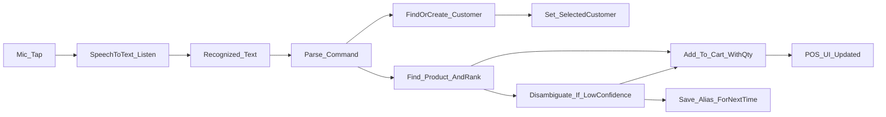

# Voice ordering cho POS (Android/iOS)

## Mục tiêu

- Trên màn POS, user bấm nút mic và nói ví dụ: “Ông B mua 1 thùng Tiger”.
- Hệ thống chuyển giọng nói → text, phân tích thành **khách hàng + danh sách item**, rồi:
  - Tìm khách theo tên; nếu không có thì tạo mới.
  - Tìm sản phẩm theo tên (“Tiger”) và thêm đúng số lượng vào giỏ.
  - **Không auto-checkout**; user vẫn bấm Checkout như flow hiện tại.
- **Chạy local**: không gọi AI cloud/LLM. Phần “hiểu lệnh + khớp khách/sản phẩm + tự học” chạy 100% local; STT dùng engine Android/iOS (có thể cần Internet tùy máy, nhưng app không gửi dữ liệu lên server riêng).

## Thiết kế luồng (high-level)

## Tăng độ chính xác (offline-smart)

- **Normalize tiếng Việt**: lowercase, bỏ dấu, chuẩn hóa khoảng trắng, map synonym (vd: “mua/lấy/đặt”, “thùng/thung”, “lốc/loc”…).
- **Candidate retrieval**: query DB theo token (LIKE) để lấy danh sách ứng viên nhỏ (vd 50-200) trước khi fuzzy, tránh load toàn bộ.
- **Ranking + confidence** (không chỉ contains): ưu tiên khớp SKU/barcode nếu có; ưu tiên khớp đủ token (Tiger + thùng); fuzzy similarity cho trường hợp STT nhận sai nhẹ; bonus điểm cho stock > 0 và SKU vừa bán gần đây (`RecentService`).
- **Disambiguation UI**: nếu mơ hồ (nhiều sản phẩm gần giống), mở bottom sheet cho user chọn đúng 1.
- **Tự học alias**: khi user chọn, lưu mapping `normalized(phrase) -> productId` (và `normalized(customerName) -> customerId`) bằng `shared_preferences`. Lần sau gặp lại phrase đó thì khớp đúng ngay.

## Thay đổi chính trong codebase

- **UI POS**: thêm nút mic + bottom sheet nghe/hiển thị text và áp lệnh.
  - File: [lib/presentation/screens/pos_screen.dart](lib/presentation/screens/pos_screen.dart)
- **State POS**: lưu “khách đang chọn” để voice có thể set và checkout dùng lại.
  - Files: [lib/features/pos/pos_state.dart](lib/features/pos/pos_state.dart), [lib/features/pos/pos_controller.dart](lib/features/pos/pos_controller.dart)
- **Tìm sản phẩm theo tên** (hiện tại repo chỉ có `getBySku`): bổ sung API tìm theo name/SKU bằng LIKE + token.
  - File: [lib/data/repositories/product_repository.dart](lib/data/repositories/product_repository.dart)
- **Parser + smart matcher**: module mới để parse/normalize, lấy candidate và xếp hạng (kèm alias memory).
  - New: `lib/features/voice/voice_order_parser.dart`, `lib/features/voice/voice_order_matcher.dart`, `lib/features/voice/voice_alias_store.dart`

## Cú pháp câu lệnh hỗ trợ (phiên bản 1)

- Mẫu chính: `<tenKhach> mua <soLuong> <donVi?> <tenSanPham>`
  - Hỗ trợ nhiều item bằng cách tách bởi “và”, ví dụ: “Ông B mua 1 thùng Tiger và 2 lốc Coca”.
- `donVi` (vd: “thùng/lốc/chai/lon…”) sẽ được coi như **tín hiệu tăng điểm khớp** (ưu tiên sản phẩm có token/alias tương ứng). Không ép quy đổi hệ số nếu không có dữ liệu quy cách.
- Số lượng: hỗ trợ số dạng `1,2,3…` và từ cơ bản `một/hai/ba…`. Nếu thiếu số lượng thì default = 1.

## Các bước triển khai

1. **Thêm speech-to-text**

   - Cập nhật [pubspec.yaml](pubspec.yaml) thêm dependency `speech_to_text`.
   - Android: thêm quyền `RECORD_AUDIO` trong `android/app/src/main/AndroidManifest.xml`.
   - iOS: thêm `NSMicrophoneUsageDescription` và `NSSpeechRecognitionUsageDescription` trong `ios/Runner/Info.plist`.

2. **Bổ sung tìm sản phẩm theo tên**

   - Thêm vào `ProductRepository` hàm kiểu `searchByTokens(List<String> tokens, {int limit})` để query `name LIKE %token%` (AND nhiều token) và/hoặc `sku LIKE %token%`, trả về **candidate list** cho bước ranking.

3. **Tạo parser + normalize**

   - Tạo file mới `lib/features/voice/voice_order_parser.dart`:
     - `normalize()` (lowercase + bỏ dấu tiếng Việt) để match ổn hơn.
     - `parse(text)` trả về `customerName` + list `{productQuery, quantity, unit?}`.
     - Logic tách theo keyword “mua/lấy/đặt/order” và theo “và”.

4. **Offline-smart matcher + alias memory**

   - Tạo `voice_order_matcher.dart`:
     - Nhận `productQuery + unit + tokens` → gọi `ProductRepository.searchByTokens()` lấy candidates.
     - Tính score/fuzzy similarity (Dart thuần, chạy local).
     - Nếu low-confidence → trả về top N để UI cho chọn.
   - Tạo `voice_alias_store.dart` (dùng `shared_preferences`) để lưu:
     - `productAlias: Map<String, int>` và `customerAlias: Map<String, int>`.
     - Khi user chọn 1 candidate, lưu alias để lần sau auto-match.

5. **Mở rộng POS state/controller để voice áp lệnh**

   - `PosState`: thêm `Customer? selectedCustomer`.
   - `PosController`:
     - `setCustomer(Customer?)`
     - `addProductWithQuantity(Product, int qtyDelta)`

6. **UI tích hợp trên POS**

   - `pos_screen.dart`:
     - Thay FAB demo hiện tại bằng **mic**.
     - Mic mở bottom sheet “Nghe…” hiển thị text nhận được.
     - Khi có text cuối cùng: parse → find/create customer → match + score → add to cart.
     - Nếu low-confidence: hiển thị bottom sheet danh sách top candidates (kèm tên/SKU/giá/tồn), user chọn 1.
     - Sau khi user chọn: lưu alias để lần sau khớp đúng.
     - Nút “chọn khách” hiện tại sẽ **set vào state** (để nhất quán với voice).
     - Checkout: dùng `state.selectedCustomer` nếu có (không hỏi lại).

7. **Chạy codegen & kiểm tra**

   - Chạy `build_runner` để cập nhật `pos_state.freezed.dart` sau khi thêm field.
   - Test thủ công trên Android/iOS:
     - “Ông B mua 1 thùng Tiger” → tạo khách (nếu chưa có) + giỏ có Tiger qty=1.
     - “Ông B mua 2 Tiger” → qty tăng đúng.
     - Trường hợp sản phẩm không tìm thấy → báo lỗi rõ ràng.